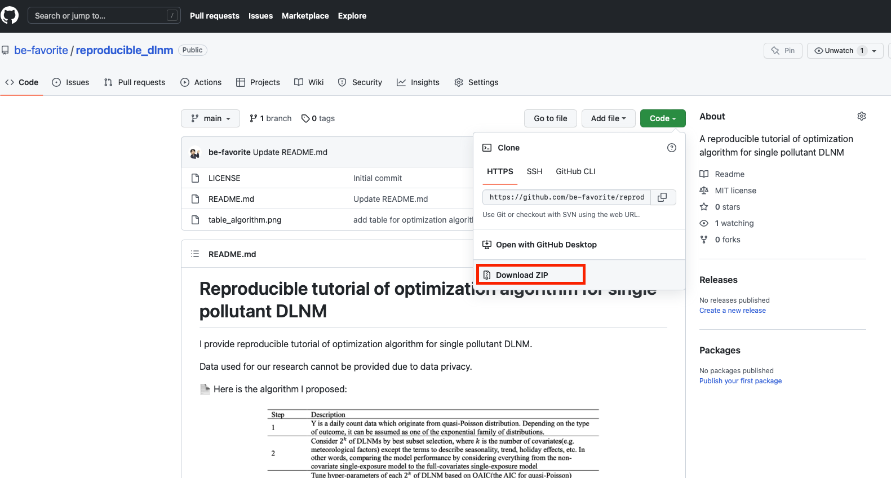

# Reproducible tutorial of optimization algorithm for single pollutant DLNM
I provide reproducible tutorial of optimization algorithm for single pollutant DLNM.

Data used for our research cannot be provided due to data privacy.

📄 Here is the algorithm I proposed:

 

In summary, this algorithm optimizes the model candidates considered through best subset selection, one of the variable selection methods used in traditional regression analysis. 

The model with the smallest QAIC value is selected as the best model.

However, the algorithm selects the simplest model if there are models with a QAIC diffrences of less than 2 from the optimal model.

The code in this tutorial is written in tidyverse syntax.

If you understand the tutorial completely, you will be able to easily model with more cities, covariates, etc., by making small modifications to `./paper_reproducible_tutorial_code.R` and `./paper_reproducible_tutorial_custom_function.R`.

## 🔎 Tutorial detail

### Before starting

- Click "Code" above and download this repo

 

- open the R project file `reproducible_dlnm.Rpoj` in the downloaded folder `reproducible_dlnm-main`

- open the code `paper_reproducible_tutorial_code.R`

- Run code line by line

- The steps below are a summary of the tutorial process.

### Step 1 Loading custom function
Loading custom function for optimization DLNM and visualization the results

### Step 2 Loading and being ready to data
Loading data. 

In this step, I manipulated the data for the tutorial. 

Don't mind! It's just a reproducible example.

### Step 3 EDA

EDA with {patchwork}

### Step 4 Adding some seasonality terms

Adding some fourier terms for daily and weekly seasonalities

### Step 5 Optimization and multivariate meta-analysis

Optimizing DLNM for each cities using parallel processing and doing multivariate meta-analysis (fixed effect)

In this step, the optimal model is saved as .Rdata on `"./Best models/"`

The optimal model object includes lot's of informations:

- `tuned_best`: The results of grid search

- `formula`: The formula of optimal model

- `cb`: The cross-basis matrix of optimal model.

- `predictions`: predicted values

- `highlow`: predicted values for visualizing high effect and low effect plots

### Step 6 Visualization

Visualizing the analsis results with {ggplot2} and {patchwork}

In this step, all figures are saved as .png on `"./plot/"`
