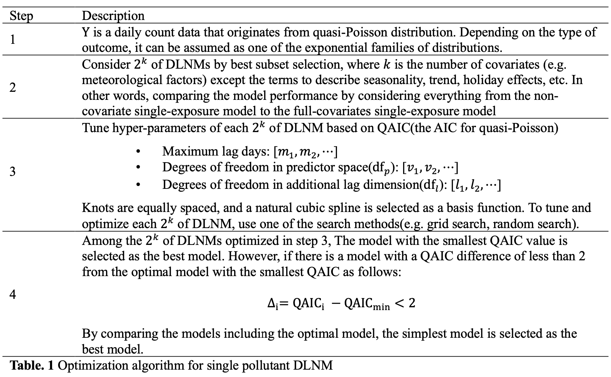

# Reproducible tutorial of optimization algorithm for single pollutant DLNM
I provide reproducible tutorial of optimization algorithm for single pollutant DLNM.

Data used for our research cannot be provided due to data privacy.

📄 Here is the algorithm I proposed:

 

In summary, this algorithm optimizes the model candidates considered through best subset selection, one of the variable selection methods used in traditional regression analysis. 

The model with the smallest QAIC value is selected as the best model.

However, the algorithm selects the simplest model if there are models with a QAIC diffrences of less than 2 from the optimal model.

## 🔎 Tutorial detail

### Step 1 Loading custom function
Loading custom function for optimization DLNM and visualization the results

### Step 2 Load and being ready to data
Loading and being ready to data. 

In this step, I manipulated the data for the tutorial. 

Don't mind! Just a reproducible example!.

### Step 3 EDA

EDA with {patchwork}

### Step 4 Add some seasonality terms

Adding some fourier terms for daily and weekly seasonalities

### Step 5 Optimization and multivariate meta-analysis

Optimizing DLNM for each cities and doing multivariate meta-analysis (fixed effect)

### Step 6 Visualization

Visualizing the analsis results with {ggplot2} and {patchwork}
